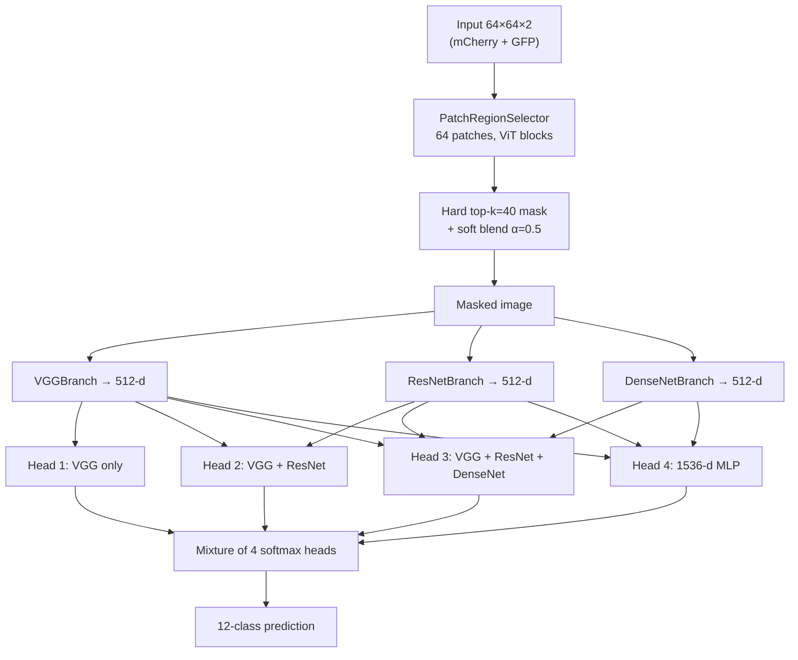

# MaSE-Net Lite v2 — Architecture

**MaSE-Net** = **M**asked **S**elective **E**nsemble Network

This document describes **MaSE-Net Lite v2**, the configuration used for the full DeepYeast run that reached **89.1% test accuracy** (vs. official Keras **88.4%**).

Implementation: `pytorch/mase_lite_net.py` · Training: `pytorch/train_mase_lite.py`

---

## 1. Problem and I/O

**Task:** 12-class protein subcellular localization on DeepYeast microscopy images.

| Item | Shape / value |
|------|----------------|
| Input | `(B, 2, 64, 64)` — 2 fluorescence channels |
| Channel 0 | mCherry (cell outline) |
| Channel 1 | GFP (protein signal) |
| Output | 12-class logits (internally fused log-probabilities for loss) |
| Parameters | ~7.0M (`7,025,795` in the full-data run) |

Pixels are normalized to approximately `[-1, 1]` by the data loader (`pytorch/dataset.py`).

---

## 2. Design idea

MaSE-Net Lite combines three ideas from prior DeepYeast work:

| Line | Contribution in MaSE-Net Lite |
|------|------------------------------|
| **Masked** | ViT-style patch selector → spatial mask on informative regions |
| **PLCNN** | Three diverse CNN branches (VGG / ResNet / DenseNet) on the masked image |
| **MSMM** | Four progressive classification heads + probability mixture |

Unlike the full `train_mase.py` variant, **Lite v2** does **not** use the heavy MSMM ResNet-34 backbone. It keeps the PLCNN triple branches and MSMM-style **multi-head ensemble** only, which is efficient on CPU and scales well to full data on GPU.



---

## 3. Stage 1 — Masked patch selection

**Module:** `PatchRegionSelector` in `pytorch/masked_net.py`

### 3.1 Patch tokenization

- Image size: **64×64**, patch size: **8×8** → **8×8 = 64** patches.
- Each patch is flattened to **8×8×2 = 128** values, then projected to **embed_dim = 64**.
- A learnable **positional embedding** `(1, 64, 64)` is added per patch.

### 3.2 Transformer selector (2 layers)

Each `_SelectorBlock` contains:

1. LayerNorm → **4-head multi-head self-attention** → residual  
2. LayerNorm → MLP **64 → 128 → 64** (GELU) → residual  

The selector scores every patch for relevance to classification.

### 3.3 Hard top-k mask (v2 default)

Config: `top_k_patches = 40`, `use_soft_probs = false`.

- A linear head outputs one score per patch; `sigmoid` gives soft probabilities `patch_probs`.
- **Hard top-k:** keep the **40 highest-scoring** patches (out of 64).
- Gradients flow through a **straight-through** estimator (`hard - soft.detach() + soft`).
- Patch mask is upsampled to **64×64** pixels.

**Effective coverage:** 40/64 = **0.625** (fixed during training; stable on full data).

### 3.4 Soft spatial blending

Config: `soft_mask_alpha = 0.5`.

The masked image is not a hard zero-out. With blend factor α:

```
masked_x = α · x + (1 − α) · (x ⊙ pixel_mask)
```

With α = 0.5, background patches are attenuated but not fully removed, which improves training stability.

### 3.5 Sparsity regularizer (training only)

`mask_sparsity_loss` encourages the mean of `patch_probs` to stay near the target coverage (0.625), with weight **0.05** in the default recipe.

---

## 4. Stage 2 — PLCNN triple branches

**Module:** `VGGBranch`, `ResNetBranch`, `DenseNetBranch` in `pytorch/plcnn_triple_net.py`

All three branches take the **same masked image** `(B, 2, 64, 64)` and output a **512-dimensional** embedding (`BRANCH_DIM = 512`).

### 4.1 Shared stage design

Each branch has **4 stages** with channel widths **32 → 64 → 128 → 256**.

After every stage:

1. **Global average pooling** on the feature map  
2. Concatenate GAP vectors from all stages so far  
3. **SE (squeeze–excitation)** vector attention (`reduction = 16`)  
4. Linear → ReLU → **Dropout** (`branch_dropout = 0.4` in v2)

### 4.2 Branch differences

| Branch | Block pattern per stage |
|--------|-------------------------|
| **VGG** | 2× Conv3×3 + BN + ReLU, then MaxPool2×2 |
| **ResNet** | Conv3×3 + BN + ReLU + **2× residual blocks**, then MaxPool |
| **DenseNet** | **DenseBlock** (4 layers, growth 32) + 1×1 transition + MaxPool |

The three architectures capture complementary patterns: local textures (VGG), deeper residual features (ResNet), and dense feature reuse (DenseNet).

---

## 5. Stage 3 — MSMM-style progressive heads

**Module:** `MaSELiteNet.heads` in `pytorch/mase_lite_net.py`

Four classifiers operate on **progressively richer** feature combinations (MSMM-style multi-scale ensemble, without the full MSMM ResNet backbone):

| Head | Input features | Classifier |
|------|----------------|------------|
| **Head 1** | VGG only — 512-d | `Linear(512 → 12)` |
| **Head 2** | VGG ∥ ResNet — 1024-d | `Linear(1024 → 12)` |
| **Head 3** | VGG ∥ ResNet ∥ DenseNet — 1536-d | `Linear(1536 → 12)` |
| **Head 4** | VGG ∥ ResNet ∥ DenseNet — 1536-d | `Linear(1536→512) → ReLU → Dropout(0.5) → Linear(512→12)` |

Head 1 uses a single branch; heads 2–3 add branches; head 4 adds a nonlinear bottleneck before classification.

---

## 6. Ensemble fusion

Each head produces logits → **softmax** → class probabilities `P_i`.

A learnable vector `ensemble_logits ∈ ℝ⁴` defines mixture weights:

```
w = softmax(ensemble_logits / temperature)     # optional floor min_w
P_final = Σᵢ wᵢ · P_i
output  = log(P_final)                         # for NLL / CE
```

### v2 loss (legacy, `--legacy-v2-loss`)

```
L = mean_i CE(head_i, y) + sparsity
```

Ensemble weights receive **no gradient** and stay at **w = [0.25, …]**. This is the recipe used for the **89.1%** full-data run.

### v3 loss (default)

```
L = NLL(fused, y) + 0.5 · mean_i CE(head_i, y) + 0.1 · KL(head_i ← fused) + sparsity
```

Plus optional `min_ensemble_weight = 0.05` so no head is fully suppressed. On 5% data, v3 reaches **86.1%** test (vs v2 **85.0%**).

---

## 7. Weight initialization (default recipe)

By default, `train_mase_lite.py` warm-starts from **5% stratified** checkpoints in `artifacts/checkpoints_5pct/`:

| Checkpoint | Loaded into | Tensors |
|------------|-------------|---------|
| `plcnn_triple/best.pt` | `branch_vgg`, `branch_resnet`, `branch_densenet` | 306 |
| `masked_v3k60_pytorch/best.pt` | `selector` | 29 |

All other parameters (four heads, `ensemble_logits`) are **randomly initialized** and trained on the target split.

Use `--no-init` to train entirely from scratch (no 5% warm-start).

---

## 8. Training recipe (Lite v2, full data)

Hyperparameters used in the **89.1% test** full-data run:

| Hyperparameter | Value |
|----------------|-------|
| `epochs` | 60 |
| `patience` | 15 (early stop on val accuracy) |
| `batch_size` | 64 |
| `top_k` | 40 |
| `soft_alpha` | 0.5 |
| `selector_lr` | 3×10⁻³ |
| `backbone_lr` | 1×10⁻³ |
| `weight_decay` | 1×10⁻⁴ |
| `label_smoothing` | 0.1 |
| `mask_sparsity_weight` | 0.05 |
| `branch_dropout` | 0.4 |
| `head_dropout` | 0.5 |
| `strong_augment` | on (flips, etc.) |
| `seed` | 42 |
| LR schedule | `ReduceLROnPlateau` on val accuracy (×0.5, patience 5) |

**Loss:**

```
L = mean_i CE(head_i, y) + 0.05 · (mean(patch_probs) − 0.625)²
```

---

## 9. Reported results

### 5% stratified subset (seed = 42, local pilot)

| Method | Val | Test |
|--------|-----|------|
| Official Keras DeepYeast | 76.8% | 80.6% |
| **MaSE-Net Lite v2** | 82.0% | 85.0% |

### Full DeepYeast (professor run, Lite v2 + 5% init)

| Metric | Value |
|--------|-------|
| **Test accuracy** | **89.08%** |
| Best val accuracy | 89.37% (epoch 57) |
| Mask coverage | 0.625 (stable) |
| Ensemble weights | [0.25, 0.25, 0.25, 0.25] (v2 loss; weights not trained) |

### Lite v3 (fused-CE + min_w=0.05, recommended)

| Metric | 5% pilot |
|--------|----------|
| Test | **86.1%** (vs v2 85.0%) |
| Ensemble weights | learnable, min ≥ 0.05 |

**Baseline:** official Keras DeepYeastNet on full data ≈ **88.4%** test.

---

## 10. Comparison with official DeepYeastNet

| | Keras DeepYeastNet | MaSE-Net Lite v2 |
|--|-------------------|------------------|
| Input | 64×64×2 | 64×64×2 |
| Region selection | None | ViT patch selector + top-k mask |
| Backbone | Single 8-conv + 3-FC stack (~10M) | 3× PLCNN branch (~7M total) |
| Ensemble | Single head | 4 progressive heads + mixture |
| Full-data test | 88.4% | **89.1%** |

Main gains come from (1) focusing on informative patches, (2) multi-architecture feature diversity, and (3) progressive multi-head fusion, together with strong regularization and optional 5% warm-start.

---

## 11. Code map

```
pytorch/
  mase_lite_net.py      # MaSELiteNet — full Lite v2 model
  masked_net.py         # PatchRegionSelector, mask ops, sparsity loss
  plcnn_triple_net.py   # VGG / ResNet / DenseNet branches
  deepyeast_net.py      # Standalone DeepYeastNet (used by masked baseline only)
  dataset.py            # DataLoader, augmentation
  train_mase_lite.py    # Training script (v2 recipe)
```

Related variants in this repo:

| Script | Model | Notes |
|--------|-------|-------|
| `train_mase_lite.py` | Lite v2 | **Recommended** — 89.1% full data |
| `train_mase_lite_v1.py` | Lite v1 | Earlier baseline, uniform ensemble, weaker aug |
| `train_mase.py` | Full MaSE | Adds true MSMM ResNet-34 backbone; GPU-heavy |

---

## 12. Configuration reference (`MaSELiteConfig`)

```python
MaSELiteConfig(
  num_classes=12,
  patch_size=8,
  selector_layers=2,
  embed_dim=64,
  num_heads=4,
  mlp_dim=128,
  top_k_patches=40,          # → mask coverage 0.625
  soft_mask_alpha=0.5,
  use_soft_probs=False,        # hard top-k
  branch_dropout=0.4,
  head_dropout=0.5,
  learnable_ensemble=True,
  ensemble_temperature=1.0,
)
```

---

## References

- DeepYeast dataset & Keras baseline: [tanelp/deepyeast](https://github.com/tanelp/deepyeast)
- Masked patch selection line (internal)
- PLCNN triple-branch design (collaborator)
- MSMM multi-head ensemble idea: Ding et al., 2022 (ResNet-34 variant in `train_mase.py`)

For run instructions see [FULL_DATA_QUICKSTART.md](FULL_DATA_QUICKSTART.md).
