# Academic Notes: UQ Concepts from Dibeco et al. (2024)

**Paper:** Whata, Dibeco, Madzima, & Obagbuwa (2024). *Uncertainty quantification in multi-class image classification using chest X-ray images of COVID-19 and pneumonia.* Frontiers in AI. https://doi.org/10.3389/frai.2024.1410841

**How to read this file:** English version first (Part I). Chinese version second (Part II). Within each language, content is split into **three blocks** so it is not one flat “everything is CNN UQ” pile.

| Block | What it is | What it is not |
|-------|------------|----------------|
| **A. Background** | How the paper sets up classification (OvA, CNN+DNN, Dropout) | Not the UQ methods themselves |
| **B. CNN UQ** | What “CNN UQ” means, purpose, and the four methods | Not the multi-class label scheme |
| **C. Using uncertainty** | PE threshold and certainty labels | Not model architecture |

The paper **compares** existing UQ methods; it does not invent them.

---

# Part I — English

---

## Block A — Background (before UQ)

*Read this only to understand the paper’s classification setup. Skip to Block B if you already know OvA / Dropout / DenseNet→DNN.*

### A1. Task in the paper

Three-class chest X-ray: Normal / COVID-19 / Pneumonia.  
Goal of the paper: classify **and** estimate how unreliable each prediction is.

Two families compared later: **BNN** vs **DNN with UQ** (ordinary nets + Dropout / ensembles).

### A2. How they do multi-class: One-vs-All (OvA)

Not one Softmax over 3 classes. They train **3 binary** classifiers (sigmoid + BCE). Prediction = class with the highest score.

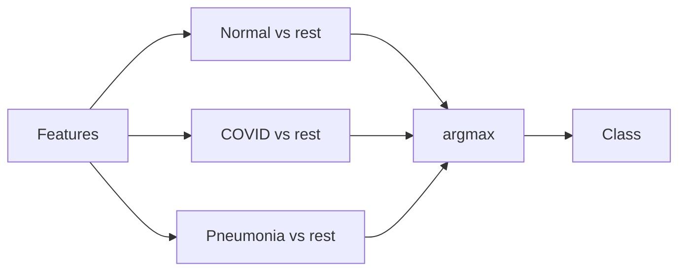

### A3. Network used for classification

Two stages:

1. **DenseNet121** → feature vector (from 224×224 image)  
2. **Small DNN** → binary OvA output (this is where Dropout sits)

DNN: `128 → 64 → 32`, each with Dropout \(p=0.5\), then 1× sigmoid.  
Training sketch: Adam, lr 0.001, batch 64, ~15 epochs; ensembles often use 5 nets.

### A4. What Dropout is

During one forward pass, randomly turn **off** some neurons (set to 0). Usual use: regularization in **training**; **off** at normal test time.

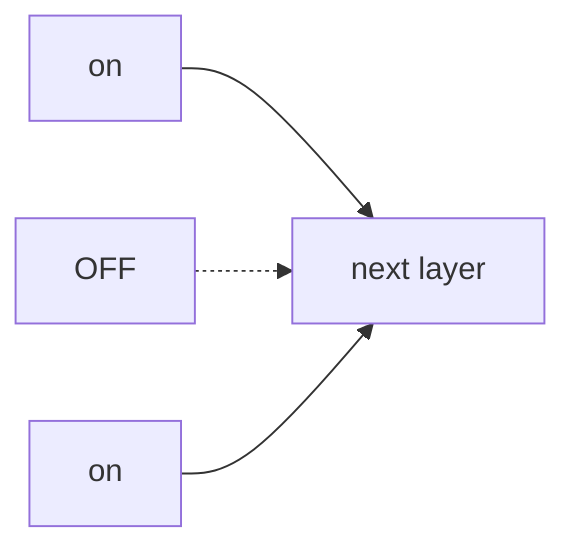

**MC Dropout** (Block B) keeps Dropout **on** at test time and repeats the forward pass many times.

### A5. Why Softmax / Sigmoid ≠ true confidence

A normal net has fixed weights → one probability per input. That number can be high even when the model is wrong or unfamiliar with the image. UQ measures whether repeated / multiple models **agree**.

---

## Block B — CNN UQ (core)

### B1. Definition

**CNN UQ** = run a CNN-based (or CNN features + DNN) classifier in a way that also outputs an **uncertainty score**, not only a class label.

It is **not** a new CNN backbone name. It is a set of **inference / training tricks** on top of a classifier.

| Output | Role |
|--------|------|
| Predicted class | Same as usual classification |
| Uncertainty (e.g. PE) | “How unsure is this prediction?” |

### B2. Purpose

| Situation | Wanted behavior |
|-----------|-----------------|
| Easy, familiar image | Correct **and certain** |
| Hard / unusual image | Mark **uncertain** → review, do not trust blindly |
| Wrong prediction | Prefer **uncertain**, not “wrong but sure” |

Purpose in one line: improve **trust and deferral**, not only accuracy.

### B3. The paper did not invent these methods

It **evaluates** existing techniques (MC Dropout, Ensemble, EMC, EBNN, plus BNN). Typical finding in the paper: **EBNN / EMC** often beat plain BNN on their UQ metrics.

### B4. Shared math (all methods below)

Mean probability over stochastic samples, then **predictive entropy (PE)**:

\[
\mu = \frac{1}{T}\sum_{t=1}^{T} p_t
\qquad
PE = -\sum_{c} \mu_c \log \mu_c
\]

- Small PE → certain  
- Large PE → uncertain  

Class prediction: \(\arg\max \mu\).

### B5. Method 1 — MC Dropout

One network. Test-time Dropout **on**. Forward \(T\) times → average → PE.

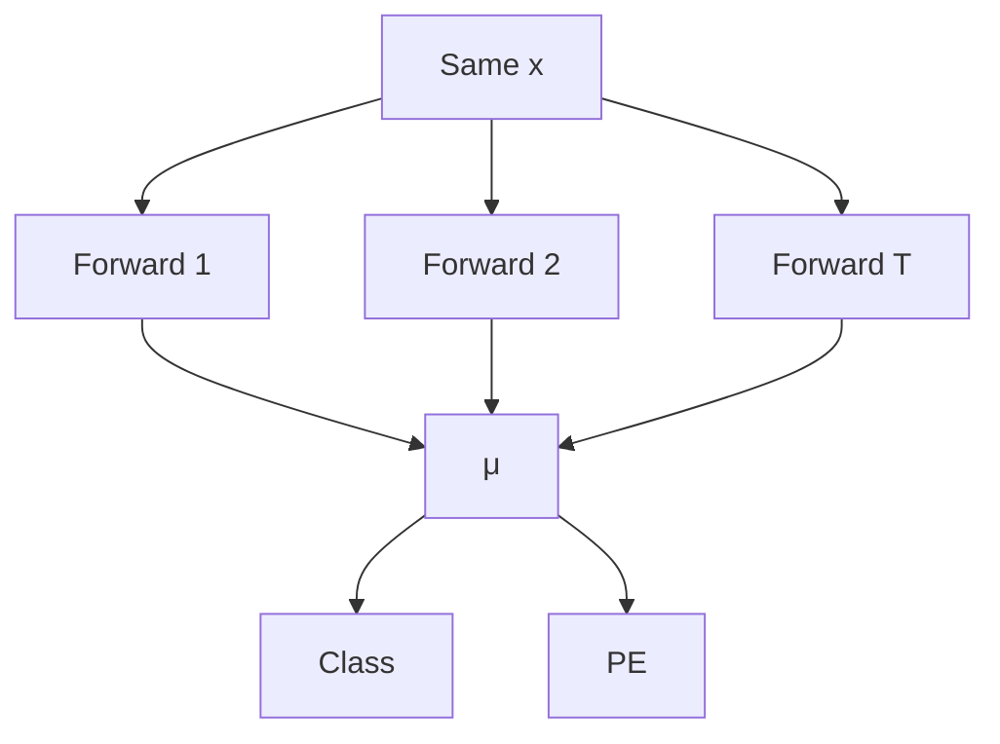

### B6. Method 2 — Ensemble

Train \(N\) networks (often \(N=5\)). One forward each → average probabilities → PE.

### B7. Method 3 — EMC (Ensemble + MC Dropout)

Each of \(N\) nets also runs \(T\) MC forwards; pool all samples → PE. Strongest stochastic coverage; most expensive.

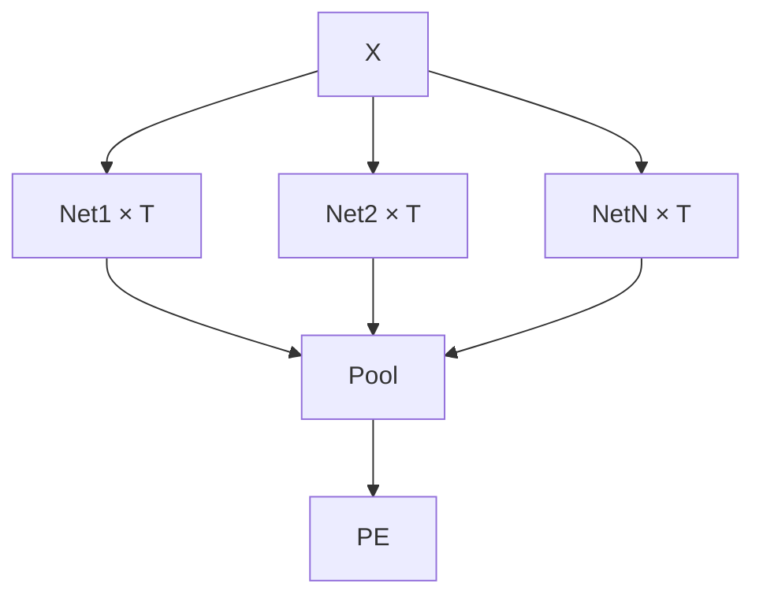

### B8. Method 4 — EBNN

Ensemble of Bayesian-style networks; average probabilities → PE. Often competitive with EMC in the paper.

### B9. Method comparison

| Method | Randomness from | Cost |
|--------|-----------------|------|
| MC Dropout | Dropout in **one** net | Low–medium |
| Ensemble | **N** trained nets | Medium |
| EMC | N nets × T Dropouts | High |
| EBNN | N Bayesian-style nets | High |

---

## Block C — Turning PE into “certain / uncertain”

Threshold \(\tau\) (related work often uses \(0.30\)):

- \(\mathrm{PE} < \tau\) → **certain**
- \(\mathrm{PE} \ge \tau\) → **uncertain**

Then cross with correct/incorrect:

| | Certain | Uncertain |
|--|---------|-----------|
| Correct | TC (best) | FU |
| Wrong | FC (worst) | TU (OK when wrong) |

Metrics such as UAcc / USen evaluate this certainty labeling. ECE / Brier evaluate probability calibration.

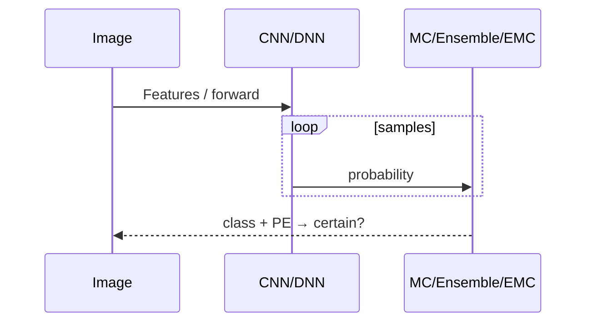

---

## English glossary

| Term | Short meaning |
|------|----------------|
| Block A | Paper’s classification setup |
| CNN UQ | Classifier + uncertainty score |
| OvA | C binary “one vs rest” heads |
| PE | Predictive entropy |
| MC / Ensemble / EMC / EBNN | Four UQ procedures in Block B |

---

# Part II — 中文

---

## 读法说明

本文件**不全是**「CNN UQ 方法说明书」。按三块读，避免混在一起：

| 板块 | 内容 | 不是什么 |
|------|------|----------|
| **A. 背景** | 论文怎么做分类（OvA、CNN+DNN、Dropout） | 还不是 UQ 四种算法 |
| **B. CNN UQ** | CNN UQ 含义、目的、四种方法 | 不是多分类标签怎么拆 |
| **C. 使用不确定度** | PE 阈值与「确定/不确定」 | 不是网络结构细节 |

论文是**对比**已有方法，不是发明这四种方法。

---

## 板块 A — 背景（UQ 之前）

*只为理解论文分类设定。若已熟悉 OvA / Dropout / DenseNet→DNN，可直接看板块 B。*

### A1. 论文任务

胸片三分类：正常 / COVID-19 / 肺炎。  
目标：既分类，又估计「这次预测有多不可靠」。

后文对比两类：**BNN** vs **DNN with UQ**（普通网络 + Dropout / 集成）。

### A2. 多分类怎么做：OvA（一类对所有）

不是一个 Softmax 分三类，而是训 **3 个二分类**（sigmoid + BCE）。预测取分数最大的类。

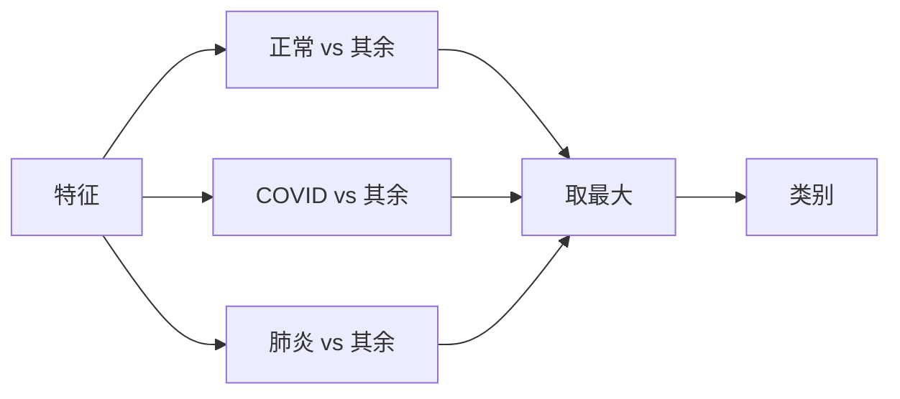

### A3. 分类网络结构

两段：

1. **DenseNet121** → 特征向量（224×224 图）  
2. **小 DNN** → OvA 二分类输出（Dropout 加在这里）

DNN：`128 → 64 → 32`，每层 Dropout \(p=0.5\)，最后 1 维 sigmoid。  
训练约：Adam，lr 0.001，batch 64，约 15 epoch；集成常用 5 个网。

### A4. Dropout 是什么

一次前向中，随机把一部分神经元**关掉**（置 0）。常规用法：只在**训练**开；普通**测试**关。

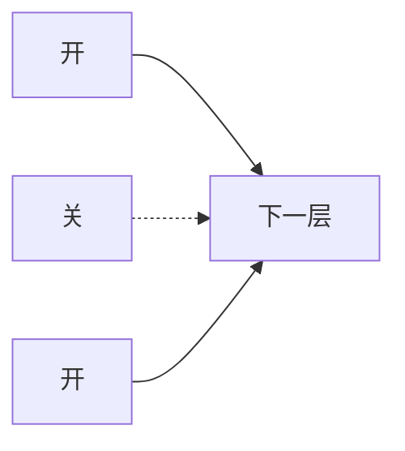

**MC Dropout**（板块 B）在测试时仍保持 Dropout 打开，并重复前向多次。

### A5. 为何概率 ≠ 真自信

普通网络权重固定 → 每个输入一个概率。这个数可以很大，但模型仍可能错或不熟。UQ 看的是：多次 / 多模型是否**意见一致**。

---

## 板块 B — CNN UQ（核心）

### B1. 定义

**CNN UQ** = 在 CNN（或 CNN 特征 + DNN）分类器上，除了类别，再给出一个**不确定分数**。

它**不是**一种新骨干网络的名字，而是分类器之上的一类**推断/训练技巧**。

| 输出 | 作用 |
|------|------|
| 预测类别 | 和平时分类一样 |
| 不确定度（如 PE） | 「这次有多没把握」 |

### B2. 目的

| 情况 | 希望 |
|------|------|
| 简单、熟悉的图 | 对，且**确定** |
| 难、少见的图 | 标**不确定** → 复核，别盲信 |
| 预测错了 | 最好是**不确定**，而不是「错却很自信」 |

一句话：提高**可信度与可推迟决策**，不只提高准确率。

### B3. 方法不是本文发明的

论文**评估**已有技术（MC Dropout、Ensemble、EMC、EBNN，以及 BNN）。经验上常见结论：**EBNN / EMC** 往往优于普通 BNN。

### B4. 共用公式（下面四种都用）

对多次随机预测求平均概率，再算**预测熵 PE**：

\[
\mu = \frac{1}{T}\sum_{t=1}^{T} p_t
\qquad
PE = -\sum_{c} \mu_c \log \mu_c
\]

- PE 小 → 较确定  
- PE 大 → 较不确定  

类别：\(\arg\max \mu\)。

### B5. 方法 1 — MC Dropout

一个网络；测试时 Dropout **开**；前向 \(T\) 次 → 平均 → PE。

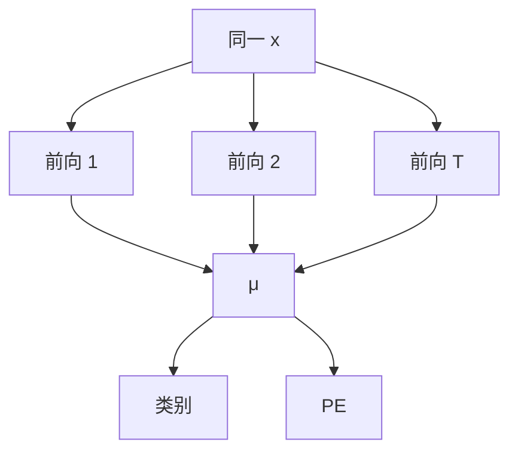

### B6. 方法 2 — Ensemble（集成）

训 \(N\) 个网络（常 \(N=5\)）。各前向一次 → 平均概率 → PE。

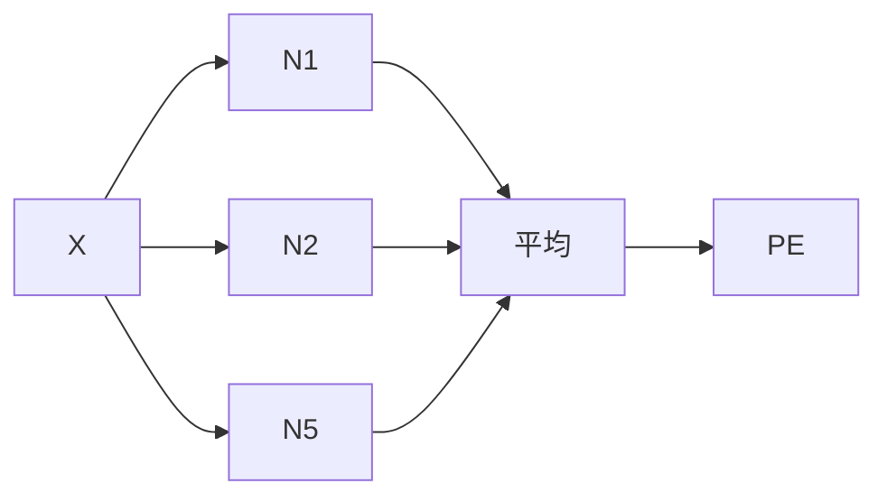

### B7. 方法 3 — EMC（集成 + MC Dropout）

\(N\) 个网络各自再做 \(T\) 次 MC；全部样本汇总 → PE。覆盖最全，也最贵。

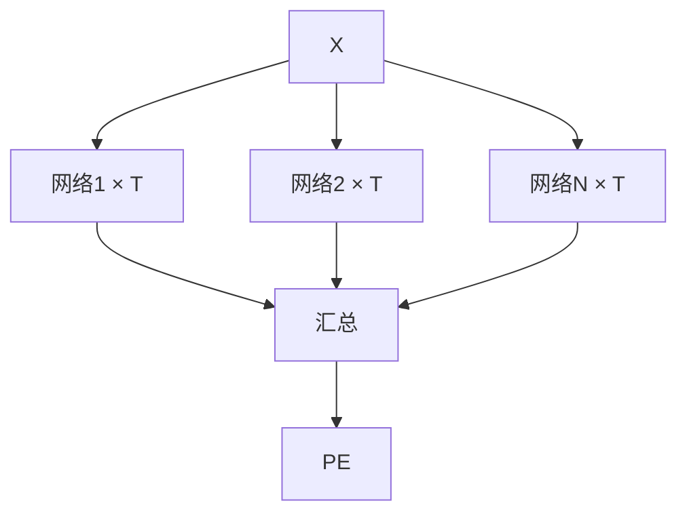

### B8. 方法 4 — EBNN

多个贝叶斯式网络做集成；概率平均 → PE。文中常与 EMC 同属较强一档。

### B9. 方法对比

| 方法 | 随机从哪来 | 成本 |
|------|------------|------|
| MC Dropout | **一个**网里的 Dropout | 低～中 |
| Ensemble | **N** 个已训网络 | 中 |
| EMC | N 个网 × T 次 Dropout | 高 |
| EBNN | N 个贝叶斯式网络 | 高 |

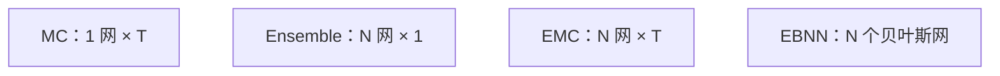

---

## 板块 C — 把 PE 变成「确定 / 不确定」

阈值 \(\tau\)（相关工作常用 \(0.30\)）：

- \(\mathrm{PE} < \tau\) → **确定**
- \(\mathrm{PE} \ge \tau\) → **不确定**

再与对/错交叉：

| | 确定 | 不确定 |
|--|------|--------|
| 对 | TC（最好） | FU |
| 错 | FC（最差） | TU（出错时更可取） |

UAcc / USen 等评估「确定性标得好不好」；ECE / Brier 评估概率校准。

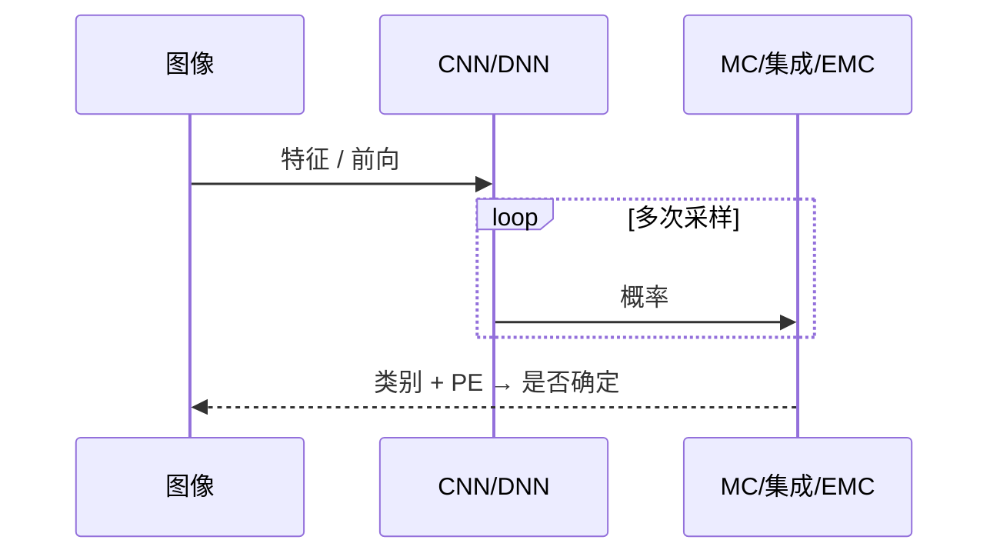

---

## 中文术语速查

| 术语 | 短义 |
|------|------|
| 板块 A | 论文的分类设定（还不是 UQ 算法） |
| CNN UQ | 分类 + 不确定分数 |
| OvA | C 个「一类对其余」二分类头 |
| PE | 预测熵 |
| MC / Ensemble / EMC / EBNN | 板块 B 的四种 UQ 做法 |

---

## 文献

Whata A, Dibeco K, Madzima K, Obagbuwa I (2024). Uncertainty quantification in multi-class image classification using chest X-ray images of COVID-19 and pneumonia. *Frontiers in Artificial Intelligence*. https://doi.org/10.3389/frai.2024.1410841
