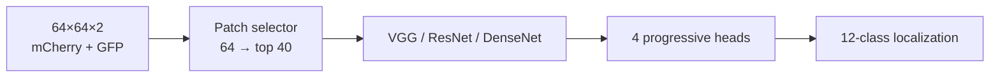

# MaSE-Net

**MaSE-Net** = **M**asked **S**elective **E**nsemble Network for 12-class yeast protein localization on DeepYeast fluorescence images [[1]](#references).

Undergraduate research with Dr. K.Y. Liu (CUHK Statistics). PyTorch. Manuscript in preparation.

This repo has three pieces:

1. A faithful reimplementation of the official Keras **DeepYeastNet** [[1]](#references) on the official 65k / 12.5k / 12.5k split — **88.4%** test accuracy (paper ~89%).
2. **MaSE-Net**: a ViT-style selector [[3]](#references) keeps the top 40 of 64 patches so the model has to decide *which spatial regions* drive the label, then mixes VGG / ResNet / DenseNet heads in an MSMM-style progressive ensemble [[2]](#references). About **89.6%** without TTA, **89.8%** with TTA [[7]](#references). A learned mask beats random spatial bagging (**89.0% vs 86.3%**; RF-style subset+vote intuition only [[9]](#references)).
3. Test-time **MC Dropout** [[4]](#references) uncertainty: UAUC on predictive entropy = **0.9249** [[5]](#references) [[6]](#references). v8 uses input-dependent mixing [[8]](#references).



## References

1. Pärnamaa T, Parts L. Accurate classification of protein subcellular localization from high-throughput microscopy images using deep learning. *G3: Genes, Genomes, Genetics*. 2017. [doi:10.1534/g3.117.043687](https://doi.org/10.1534/g3.117.043687). Official Keras: [tanelp/deepyeast](https://github.com/tanelp/deepyeast).
2. Ding J, Xu J, Wei J, Tang J, Guo F. A multi-scale multi-model deep neural network via ensemble strategy on high-throughput microscopy image for protein subcellular localization. *Expert Systems with Applications*. 2023;212:118744. [doi:10.1016/j.eswa.2022.118744](https://doi.org/10.1016/j.eswa.2022.118744).
3. Dosovitskiy A, Beyer L, Kolesnikov A, et al. An image is worth 16×16 words: Transformers for image recognition at scale. *ICLR*. 2021. [arXiv:2010.11929](https://arxiv.org/abs/2010.11929).
4. Gal Y, Ghahramani Z. Dropout as a Bayesian approximation: representing model uncertainty in deep learning. *ICML*. 2016. [PMLR 48:1050–1059](https://proceedings.mlr.press/v48/gal16.html).
5. Asgharnezhad H, Shamsi A, Pedramfar S, et al. Objective evaluation of deep uncertainty predictions for COVID-19 detection. *Scientific Reports*. 2022. [doi:10.1038/s41598-022-05052-x](https://doi.org/10.1038/s41598-022-05052-x).
6. Whata A, Dibeco K, Madzima K, Obagbuwa I. Uncertainty quantification in multi-class image classification using chest X-ray images of COVID-19 and pneumonia. *Frontiers in Artificial Intelligence*. 2024. [doi:10.3389/frai.2024.1410841](https://doi.org/10.3389/frai.2024.1410841).
7. Shanmugam D, Blalock D, Balakrishnan G, Guttag J. Better aggregation in test-time augmentation. *ICCV*. 2021. [arXiv:2011.11156](https://arxiv.org/abs/2011.11156).
8. Jacobs RA, Jordan MI, Nowlan SJ, Hinton GE. Adaptive mixtures of local experts. *Neural Computation*. 1991;3(1):79–87. [doi:10.1162/neco.1991.3.1.79](https://doi.org/10.1162/neco.1991.3.1.79).
9. Breiman L. Random forests. *Machine Learning*. 2001;45:5–32. [doi:10.1023/A:1010933404324](https://doi.org/10.1023/A:1010933404324).

**Docs:** [ARCHITECTURE.md](ARCHITECTURE.md) · [FULL_DATA_QUICKSTART.md](FULL_DATA_QUICKSTART.md) · [V4_RUN.md](V4_RUN.md) · [V5_RUN.md](V5_RUN.md) · [V6_RUN.md](V6_RUN.md) · [V6_PHASE25_RUN.md](V6_PHASE25_RUN.md) · [V7_RUN.md](V7_RUN.md) · [V8_ID_GATE_RUN.md](V8_ID_GATE_RUN.md) · [V9_RUN.md](V9_RUN.md) · [V10_RUN.md](V10_RUN.md) · [results/](results/)

## Results

JSON snapshots by version: [results/README.md](results/README.md) (`results/v2` … `results/v10`).

### Full data (seed=42, 5% init)

| Method | Test | Notes / source |
|--------|------|----------------|
| Keras baseline | 88.4% | official |
| MaSE Lite v2 | 89.1% | uniform; head-mean CE |
| MaSE Lite v3 | 87.75% | learnable; **collapsed** |
| MaSE Lite v4 | ≈89.58% | fused-CE + frozen uniform (**best train, no TTA**) |
| v5 | ~89.16% | learnable w; below v4 |
| v6 Phase 1 | 88.95% | `results/v6/phase1_results.json` |
| v6 Phase 2.5 | 89.07% | `results/v6/phase25_results.json` |
| **v6 Phase 2.5 + TTA** | **89.82%** | `results/v6/phase25_tta_summary.json` (**best overall**) |
| v7 | 89.06% | `results/v7/results.json` |
| **v7 + TTA** | **89.82%** | `results/v7/tta_summary.json` |
| v8 ID-Gate | 89.05% | `results/v8/results.json` |
| v8 + TTA | 89.69% | `results/v8/tta_summary.json` |
| v9 RSB (R=16) | 86.28% | `results/v9/rsb_summary.json` |
| v9 random-mask train | 84.87% | `results/v9/results.json` |
| v9 learned-mask ref | 88.96% | same ckpt, selector on |

Report **train** and **TTA** as separate rows. Goal 90% still open (~0.18pp vs best TTA). v9/v10 are RF-sketch ablations, not the 90% path. See architecture contrast in [ARCHITECTURE.md §10](ARCHITECTURE.md#10-later-recipes-v8--v9--v10) and [V9_RUN.md](V9_RUN.md) / [V10_RUN.md](V10_RUN.md).

### 5% pilot (seed=42)

| Method | Val | Test |
|--------|-----|------|
| Official Keras DeepYeast | 76.8% | 80.6% |
| MaSE-Net Lite v2 | 82.0% | 85.0% |
| MaSE-Net Lite v3 (learnable) | — | 86.1% |
| MaSE-Net Lite v4 (frozen) | 82.7% | **85.9%** |
| MaSE Lite **v10** SFRM (unmasked) | 83.2% | 85.1% |
| MaSE Lite v10 + 7-window vote | — | 84.3% |
| MaSE Lite v10 + selector (S=16) | 83.7% | 85.7% |

**Run docs:** v6 [V6_RUN.md](V6_RUN.md) / [V6_PHASE25_RUN.md](V6_PHASE25_RUN.md); v7 [V7_RUN.md](V7_RUN.md); v9 [V9_RUN.md](V9_RUN.md); v10 [V10_RUN.md](V10_RUN.md).

## Download DeepYeast data

**Important:** `prepare_deepyeast_subset.py` defaults to a **5% subset** (`deepyeast_5pct`, ~4,500 images).
Running it with **no flags does NOT create `deepyeast_full`.**

| Goal | Command |
|------|---------|
| **Full dataset** (~90,000 images) | `python prepare_deepyeast_subset.py --fraction 1.0 --out-dir deepyeast_full --seed 42` |
| 5% smoke test only | `python prepare_deepyeast_subset.py --fraction 0.05 --out-dir deepyeast_5pct --seed 42` |

After full download you should see **train 65,000 / val 12,500 / test 12,500** under `deepyeast_full/`.
Training uses `--data-dir /path/to/deepyeast_full`.

Details (cache location, re-download, verification): **[FULL_DATA_QUICKSTART.md](FULL_DATA_QUICKSTART.md)** → *Download full data*.

## Recommended scripts

### v4 (accuracy SOTA)

```bash
python pytorch/train_mase_lite.py \
  --data-dir /path/to/deepyeast_full \
  --freeze-ensemble \
  --epochs 60 --patience 15 --top-k 40 \
  --mask-sparsity-weight 0.05 --label-smoothing 0.1 \
  --seed 42 --checkpoint-name mase_lite_full_v4
```

### v5 (learnable anti-collapse + UQ)

```bash
python pytorch/train_mase_lite.py \
  --data-dir /path/to/deepyeast_full \
  --v5 \
  --epochs 60 --patience 15 --top-k 40 \
  --mask-sparsity-weight 0.05 --label-smoothing 0.1 \
  --seed 42 --checkpoint-name mase_lite_full_v5
```

Reports `uq.test_AUROC_PE` (PE → AUROC). Softmax baseline is secondary only.

### v9 RSB / v10 SFRM (professor `git pull` then one flag)

```bash
python pytorch/train_mase_lite.py --data-dir /path/to/deepyeast_full --v9 --seed 42
python pytorch/train_mase_lite.py --data-dir /path/to/deepyeast_full --v10 --seed 42
```

See [V9_RUN.md](V9_RUN.md) (RF-style per-image bagging) and [V10_RUN.md](V10_RUN.md) (shared-region mask).

- Reproduce **v2** (89.1%): `--legacy-v2-loss --checkpoint-name mase_lite_full_v2`
- Reproduce **v3**: default flags without `--freeze-ensemble` / `--v5`

Init weights (5% PLCNN + masked selector) ship under `artifacts/checkpoints_5pct/` and load automatically unless `--no-init`.

## Layout

```
prepare_deepyeast_subset.py
pytorch/
  train_mase_lite.py      # ★ Lite v2 / v3 / v4 (flags)
  train_mase_lite_v1.py
  train_mase.py
  eval_mase_uq.py         # MC Dropout UQ (optional)
artifacts/checkpoints_5pct/
V4_RUN.md
V6_RUN.md
V9_RUN.md
V10_RUN.md
FULL_DATA_QUICKSTART.md
ARCHITECTURE.md
UQ_MC_DROPOUT.md
```

## Requirements

- Python 3.11 or 3.12
- PyTorch ≥ 2.0 (CUDA strongly recommended for full data)
- Git LFS for init checkpoints
