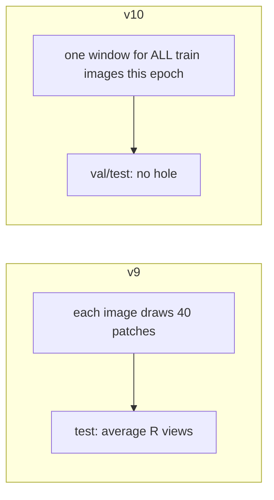

# MaSE-Net Lite **v10** — Shared-Fixed-Region Mask (SFRM)

Runnable version of the sketch **“random select a region for all image”**. **v9** is per-image random patches (RF bagging). **v10** is **one shared** \(S\times S\) window for the whole train set that epoch.

Still **one model**. `--v10` = `--sfrm`. Do not combine with `--v9`.

| | **v9 RSB** | **v10 SFRM (this recipe)** |
|--|------------|---------------------------|
| Mask | per-image random top-k | **all train images** share one zeroed \(S\times S\) window |
| When | every forward | **once per train epoch** |
| Val / test | random mask / RSB average | **full image, no hole** |
| Recipe | Phase-1, heads+`w` | **v4 frozen \(w=0.25\)**, selector off by default |
| Numbers so far | full RSB **86.28%** (learned ref 88.96%) | 5% unmasked **85.09%** / +selector **85.71%** (5% v4 **85.87%**) |

**Train vs test (not a contradiction):** shared region is **train-only**. Val/test stay **unmasked**. Multi-window vote at test is optional (hurt on 5%).

Contrast: [V9_RUN.md](V9_RUN.md). Full comparison is at the bottom of **this** file.

**Repo:** https://github.com/una-sariel/deepyeast-mase

---

## Files to send back

```text
1) <deepyeast_full>\checkpoints\mase_lite_full_v10\results.json
2) <deepyeast_full>\checkpoints\mase_lite_full_v10\sfrm_vote\summary.json
```

Report two rows: **unmasked test** (`results.json` → `test.accuracy`) and **vote test** (`sfrm_vote`). Primary number = unmasked. Compare to full v4 ≈89.58% and P2.5+TTA **89.82%**.

---

## Paths

```powershell
$REPO = "D:\UG Research\DeepYeast\Qiwu\deepyeast-mase-main_v12\deepyeast-mase"
$DATA = "D:\UG Research\DeepYeast\Qiwu\deepyeast-mase-main_v12\deepyeast_full"
cd $REPO
git pull
.venv\Scripts\activate
python -c "t=open('pytorch/train_mase_lite.py',encoding='utf-8').read(); print('v10 OK' if '--v10' in t else 'git pull again')"
```

Init (ships in the repo, same as full v4):

```powershell
dir artifacts\checkpoints_5pct\plcnn_triple\best.pt
```

---

## Train v10 (full data, `git pull` then one flag)

```powershell
python pytorch\train_mase_lite.py `
  --data-dir $DATA `
  --v10 `
  --seed 42
```

Progress bar: **`MaSELiteV10`**. Log line includes `sfrm=(r,c,S)`. Default checkpoint: `mase_lite_full_v10`.

`--v10` sets: frozen \(w=0.25\), selector **bypass**, one \(S=24\) train window per epoch, then 7-window vote. Epochs/patience match v4 (60 / 15). GPU time ≈ a v4 full run.

Keep the learned selector (better 5% variant):

```powershell
python pytorch\train_mase_lite.py `
  --data-dir $DATA `
  --v10 --sfrm-keep-selector --sfrm-size 16 --sfrm-windows 0 `
  --seed 42 `
  --checkpoint-name mase_lite_full_v10_sel
```

### Optional: short FT from v4 / Phase-1

```powershell
python pytorch\train_mase_lite.py `
  --data-dir $DATA `
  --v10 `
  --resume "$DATA\checkpoints\mase_lite_full_v4\best.pt" `
  --epochs 15 --patience 5 `
  --seed 42
```

No v4? Use Phase-1: `$DATA\checkpoints\mase_lite_full_v6_phase1\best.pt`.

---

## Defaults

| Knob | Value |
|------|--------|
| Recipe | v4 fused-CE, frozen \(w=0.25\) |
| Selector | **bypass** (unless `--sfrm-keep-selector`) |
| SFRM size | 24 |
| When | one window / train epoch, **all** train images |
| Val / test | no SFRM |
| Vote | 7 windows + full image (`--sfrm-windows 0` skips) |
| Init | `artifacts/checkpoints_5pct/plcnn_triple`; skip selector if bypass |
| Checkpoint | `mase_lite_full_v10` |

First-run ablation: **do not** stack SFRM with the learned selector, or gains/drops cannot be attributed. Default `--v10` bypasses the selector. `--sfrm-keep-selector` is a second row.

---

## What “SFRM” means (English)

**SFRM** = **S**hared-**F**ixed-**R**egion **M**ask. Project nickname, not a paper title. Each **train** epoch samples one axis-aligned \(S\times S\) window and zeros it on **every** training image (same \((r,c,S)\)). That is the sketch line **“all image same region”**.

“Shared” means the **same relative coordinates**, not the same cell content. Images differ; the hole sits at the same spatial location.

### Why rewrite the sketch this way

The sketch mixed sample subsets, a row of “trees”, a CNN, and the red box “Random select a region for all image”.

| Sketch element | Do not implement literally | Runnable v10 |
|----------------|----------------------------|-------------|
| Random Forest | sklearn RF on pixels + CNN backprop | random **spatial** subspace (one rectangle) |
| Same region for all images | ambiguous (when? how big?) | **once per epoch**, shared by the train set |
| Many trees → many Ŷ → bagging | train M CNNs (expensive, not “one model”) | optional **multi-window vote** on **one** `best.pt` |

**Role:** method / regularizer ablation vs learned selector. Protocol is clear for a write-up. Not a promise to hit 90%.

### Before v10 (v4 / learned selector)

- Masks are **per-image** (learned top-k, or v9’s independent random patches).
- Test usually uses the same family of mask (learned, or RSB vote).

### After v10 (SFRM)

- **Train:** one shared hole for the whole train set that epoch.
- **Val/test:** full image, **no hole**. Optional test-time vote averages Softmax over the full image + \(M\) random windows — extra TTA, not the training protocol. On 5% the vote **hurt**, so the number to report is **unmasked test**.



v9 = spatial **bagging** (masks not shared; primary test number is the vote).  
v10 = spatial **shared Cutout** (masks shared on train; primary test number is unmasked).

### SFRM vs ordinary Cutout

| | Common Cutout | **SFRM** |
|--|---------------|----------|
| How the window is sampled | per image / per batch | **once per epoch**, shared by the train set |
| Motive | strong augmentation | match “all image same region” + RF-style subspace |
| Val | usually unmasked | **unmasked** (matches primary test) |

Train loop (logic):

```text
# start of each epoch
r = randint(0, 64 - S)
c = randint(0, 64 - S)

# every train batch this epoch
for x, y in train_loader:
    x = x.clone()
    x[:, :, r:r+S, c:c+S] = 0   # both channels
    loss = criterion(model(x), y)

# val: no hole
val_acc = evaluate(model, val_loader, mask=None)
```

Log `mask=1.000` on the **bypass** run means the selector is identity (full coverage). The SFRM hole is applied **before** the network, not inside `mask=`.

### Optional multi-window vote (test, one model)

Still **one** `best.pt`. For each test image: full image + \(M\) random \(S\times S\) holes → mean Softmax → argmax. Views are random holes, not flips.

DeepYeast default: \(64\times64\), \(S=24\), \(M=7\) → 8 forwards. Window locations pre-sampled with a fixed seed.

```text
windows = [(r_i, c_i) for i in range(M)]  # fixed seed
probs = [softmax(model(x))]               # full image
for (r, c) in windows:
    z = x.clone()
    z[:, :, r:r+S, c:c+S] = 0
    probs.append(softmax(model(z)))
y_hat = argmax(mean(probs))
```

Forest analogy: each “tree” ≈ the same net on one occluded view; mean probability ≈ soft vote. No decision trees are trained.

| Multi-window vote (default) | True bagging (not done) |
|-----------------------------|-------------------------|
| 1 checkpoint | M checkpoints |
| train cost ×1 | train cost ×M |
| test cost ×(M+1) | test cost ×M |
| fits “one model” | closer to a row of trees, expensive |

Report SFRM-train → unmasked test first. Only add true bagging if the professor insists on many models.

### vs MaSE selector / Flip-TTA

| Mechanism | Who decides what to drop | Per-image? | Stage |
|-----------|--------------------------|------------|-------|
| MaSE learned selector | network top-k patches | yes | train + test |
| **SFRM** | random fixed rectangle | train: same for all; vote views: per view | augmentation / view |
| Flip / rot90 TTA | geometry | after transform | test only |

Do not multiply SFRM-vote with flip_rot in the first table (compute multiplies). Report separate rows.

### Recommended hyperparameters

| Item | Default | Note |
|------|---------|------|
| Image | 64×64×2 | DeepYeast |
| Window S | 24 | can sweep 16 / 32 |
| Sample frequency | once / epoch | closer to “all image” than per-batch |
| Location | uniform \(r,c \in [0, 64-S]\) | axis-aligned |
| Fill | 0 | both channels |
| Val | unmasked | pick `best.pt` |
| Test M | 7 windows + 1 full | or `--sfrm-windows 0` |
| Backbone | MaSE Lite, selector off | first version |

### How to report / success bar

1. **SFRM train → unmasked test** (primary)
2. **SFRM train → multi-window vote** (optional)

| Control | Question |
|---------|----------|
| Unmasked baseline, same architecture (5% v4 / full v4) | did SFRM hurt a lot? |
| Per-image random window | is **sharing** necessary? |
| MaSE learned selector | method contrast |

Loose method-check: unmasked test drop ≲ 0.3pp vs same-split baseline, or a small vote gain, and training stable. **Do not expect** SFRM alone to beat v4 / P2.5+TTA **89.82%**.

### FAQ

**Will the hole always cover the cell?** One epoch can hide a key region; locations are uniform across epochs. Large S (e.g. 32) is riskier; prefer 16–24.

**Why is val unmasked?** Primary test is full-image. Unmasked val selects the checkpoint that is good on that protocol. Vote is a second row.

**Is this a Random Forest?** Spiritually a random subspace (+ optional vote), not a decision-tree forest. Say so in writing.

**Relation to 90%?** Parallel line. Accuracy mainline: strong frozen ckpt (v4-class) → tiny unfreeze → flip_rot TTA. SFRM implements the shared-region sketch.

### One-line takeaway

> **SFRM = one shared \(S\times S\) hole on all train images that epoch; val/test stay unmasked. “Same region for all images” is train-only, not a contradiction with full-image test.**

---

## 「SFRM」是什么（中文说明）

**SFRM** = **S**hared-**F**ixed-**R**egion **M**ask（共享固定区域遮挡）。项目里的叫法。每个 **train** epoch 抽一个轴对齐 \(S\times S\) 窗，**所有训练图都挖同一块**（同一 \((r,c,S)\)）。对应草图 **「all image 同一 region」**。

「共享」指**相对坐标相同**，不是挡住同一个细胞内容。图的内容不同，被挖掉的是同一块空间位置。

### 为什么要这样改写草图

草图里同时有：样本子集、一排「树」、CNN、以及红框「Random select a region for all image」。

| 草图元素 | 不宜直接做的 | 可跑的 v10 |
|----------|--------------|------------|
| Random Forest | 像素上训 sklearn RF 并和 CNN 反传耦合 | 随机 **空间** 子空间（一个矩形） |
| 全体图同一区域 | 语义不清（何时？多大？） | **每个 epoch 采一次**，该 epoch 训练集共享 |
| 多棵树 → 多个 Ŷ → Bagging | 训 M 份 CNN（贵，且不是单模型） | 可选：一份 `best.pt` 上的 **多窗投票** |

**定位：** 方法/正则消融，对照可学习 selector。协议清楚，好写。不保证冲到 90%。

### v10 之前（v4 / learned selector）

- Mask **按图**来（学到的 top-k，或 v9 每张图独立随机 patch）。
- 测试通常还是同一类 mask（learned，或 RSB 投票）。

### v10（SFRM）

- **训练：** 该 epoch 全体训练图共用一块洞。
- **Val/test：** 看全图、**不挖洞**。测试时可选「全图 + M 个随机窗」平均概率，这是额外 TTA，不是训练协议。5% 上投票**掉点**，所以对外报 **未遮挡 test**。

「全图不遮」和「all image 同一 region」**不冲突**：前者是测试，后者是训练。

v9 = 空间 **bagging**（样本间不共享 mask，主数字是投票）。  
v10 = 空间 **共享 Cutout**（训练共享 mask，主数字是未遮挡 test）。

### 和普通 Cutout 差在哪

| | 常见 Cutout | **SFRM** |
|--|-------------|----------|
| 窗怎么采 | 每张图 / 每个 batch 各自随机 | **每个 epoch 一次**，训练集共用 |
| 动机 | 强数据增强 | 对齐「all image 同一 region」+ RF 式子空间 |
| Val | 通常不遮 | **不遮**（对齐主测试） |

bypass 那次日志里 `mask=1.000` 表示 selector 被关掉（覆盖率恒为 1）。SFRM 的洞在进网络**之前**挖，不写在 `mask=` 里。

### 多窗投票（推理，单模型，可选）

仍然只有 **一份** `best.pt`。每张测试图：全图 + \(M\) 个随机 \(S\times S\) 洞 → Softmax 平均。视图是随机挖洞，不是翻转。

默认：\(64\times64\)，\(S=24\)，\(M=7\) → 8 次 forward。窗位置用固定种子预采样。

「森林投票」类比：每棵「树」≈ 同一网络在某一种遮挡视图下的预测；平均概率 ≈ 软投票。并没有训出决策树。

真 Bagging（未做）是 M 份权重、训练 ×M，更贴草图「一排树」，但更贵。汇报先报 **SFRM 训练 + 全图测试**；老师坚持多模型再上真 Bagging。

### 和 MaSE selector / Flip-TTA 的差别

| 机制 | 谁决定丢掉什么 | 随图变化？ | 阶段 |
|------|----------------|------------|------|
| MaSE learned selector | 网络 top-k patch | 是 | 训练+测试 |
| **SFRM** | 随机固定矩形 | 训练：全员相同；投票：每视图不同 | 增强 / 视图 |
| Flip / rot90 TTA | 几何变换 | 变换后 | 仅测试 |

第一张表不要把 SFRM 投票和 flip_rot 乘在一起（算力相乘）。先各报一行。

### 怎么报、成功标准

1. **SFRM 训练 → 全图测试**（主协议）
2. **SFRM 训练 → 多窗投票**（可选）

宽松方法验证：全图 test 相对同划分 baseline 掉点 ≲ 0.3pp，或投票有小幅提升，且训练稳定。**不要预期**单靠 SFRM 超过 v4 / P2.5+TTA 的 **89.82%**。

### 常见疑问

**会不会总挡住细胞？** 单个 epoch 可能挡住关键区域，但窗位置跨 epoch 均匀随机。S 太大（如 32）风险更高，优先 16–24。

**为什么验证集不遮？** 主测试是看全图。Val 不遮才能选出在全图上最好的 checkpoint。投票是第二行。

**这还算 Random Forest 吗？** 精神上的随机子空间（+ 可选投票），不是决策树森林。写的时候说清楚。

**和冲 90% 什么关系？** 并行线。精度主线仍是：强 frozen ckpt（v4 级）→ 极轻量解冻 → flip_rot TTA。SFRM 用来落实「全体图同一区域」并作消融。

### 一句话

> **SFRM = 每个 epoch 全体训练图共用一块 \(S\times S\) 洞；val/test 仍看全图。「all image 同一 region」只描述训练，和全图测试不冲突。**

---

## 5% result (English; this machine, CPU, 2026-08-13)

JSON: `results/v10/5pct_results.json`, `results/v10/5pct_vote_summary.json`, `results/v10/5pct_sel_results.json`. Workspace copies: `docs/mase_results/v10/`.

Checkpoints: `deepyeast_5pct/checkpoints/mase_lite_5pct_sfrm` and `mase_lite_5pct_sfrm_sel`.

| Metric | v10 bypass S=24 | v10+selector S=16 | 5% v4 |
|--------|-----------------|-------------------|-------|
| Best val | 83.22% @ ep49 | **83.68%** @ ep49 | 82.7% |
| **Unmasked test** | **85.09%** | **85.71%** | **85.87%** |
| 7-window vote test | 84.27% (−0.64pp) | skipped | — |
| Val mask log | 1.000 (bypass) | 0.625 (top-k) | learned top-k |
| Weights | frozen 0.25×4 | frozen 0.25×4 | frozen 0.25×4 |
| Elapsed | 257.8 min CPU | 264.9 min CPU | — |

v9 full data (different scale — do not mix into this table): RSB **86.28%** / learned **88.96%** / random **84.87%** (`results/v9/`).

Full-data v10 is **not run yet**. Professor command after `git pull`:

```powershell
python pytorch\train_mase_lite.py --data-dir $DATA --v10 --seed 42
```

**Readout:** 5% v10 did not beat v4 (best −0.16pp). Vote hurt. Full-data run is a method story; do not expect a free accuracy gain.

---

## 5% 结果（中文；本机 CPU，2026-08-13）

| 指标 | v10 bypass S=24 | v10+selector S=16 | 5% v4 |
|------|-----------------|-------------------|-------|
| Best val | 83.22% @ ep49 | **83.68%** @ ep49 | 82.7% |
| **未遮挡 test** | **85.09%** | **85.71%** | **85.87%** |
| 7 窗投票 test | 84.27%（−0.64pp） | 未跑 | — |
| Val mask 日志 | 1.000（bypass） | 0.625（top-k） | learned top-k |
| 权重 | frozen 0.25×4 | frozen 0.25×4 | frozen 0.25×4 |
| 耗时 | 257.8 min CPU | 264.9 min CPU | — |

v9 是**全量**数字，不要和这张 5% 表混在一起。全量 v10 还没跑。

**读数：** 5% v10 没有超过 v4（最好 −0.16pp）。投票掉点。全量是方法故事，不要预期白捡精度。

---

## v9 vs v10 (English)

Both are **one CNN** (`best.pt`), not sklearn RandomForest and not multi-seed. They split the professor’s sketch into two recipes. **Do not** pass `--v9` and `--v10` together. See also [V9_RUN.md](V9_RUN.md).

| | **v9 RSB** | **v10 SFRM** |
|--|------------|--------------|
| Sketch line | “Random Forest” → spatial **feature bagging + vote** | “random select a region for **all** image” |
| Who shares the mask? | **Nobody** — each image independent | **All train images** that epoch |
| Unit | random **40/64 patches** (`mask_mode=random`) | one \(S\times S\) **pixel** hole (default 24) |
| When the mask changes | every **forward** | once per **train epoch** |
| Train | occlude with per-image random patches | occlude with the shared window |
| Val / test (primary) | R=16 Softmax **average** (the vote **is** the method) | **full image, no hole** |
| Vote at test | required for the v9 number | optional TTA; **hurt** on 5% (−0.64pp) |
| Recipe | resume Phase-1; freeze selector+branches; train heads+`w` | v4 frozen \(w=0.25\); selector **off** by default |
| Flag | `--v9` | `--v10` (`--sfrm`) |
| Checkpoint | `mase_lite_full_v9` | `mase_lite_full_v10` |
| JSON | `results/v9/` | `results/v10/` |

**Train vs test is not a contradiction on v10:** “all images same region” is **train-only**. “Unmasked full image” is **val/test**.

### Numbers (do not mix scales)

| | Data | Primary test | Same-ckpt / same-split reference |
|--|------|--------------|----------------------------------|
| v9 | **full**, seed=42 | RSB **86.28%** | learned selector **88.96%**; random single 84.87% |
| v10 bypass S=24 | **5%** | unmasked **85.09%** (vote 84.27%) | 5% v4 **85.87%** |
| v10 + selector S=16 | **5%** | unmasked **85.71%** | 5% v4 **85.87%** |

Full-data v10 is not run yet.

### Readout

- v9 **hurts** vs the learned selector on the same full-data weights (−2.7pp). Bagging story, not a 90% path.
- 5% v10 did **not** beat 5% v4 (best −0.16pp). Shared-region story; do not expect a free accuracy gain.
- Accuracy mainline is still **v4 train ≈89.58%** / **Phase 2.5 + TTA 89.82%**.

### One-line

> **v9 = per-image random patches + vote (bagging). v10 = one shared hole on all train images (shared Cutout); test stays unmasked.**

---

## v9 vs v10（中文）

两者都是**一份 CNN**（`best.pt`），不是 sklearn RandomForest，也不是多 seed。老师草图拆成两条配方。**不要**同时开 `--v9` 和 `--v10`。对照见 [V9_RUN.md](V9_RUN.md)。

| | **v9 RSB** | **v10 SFRM** |
|--|------------|--------------|
| 对应草图 | 「Random Forest」→ 空间 **feature bagging + 投票** | 「random select a region for **all** image」 |
| 谁共享 mask | **不共享**，每张图自己抽 | 该 epoch **所有训练图**同一窗 |
| 单位 | 随机 **40/64 patch**（`mask_mode=random`） | 一个 \(S\times S\) **像素**洞（默认 24） |
| 何时换 | 每个 **forward** | 每个 **train epoch** 一次 |
| 训练 | 每张图随机 patch 遮挡 | 全体训练图挖同一块 |
| Val / test（主数字） | R=16 Softmax **平均**（投票**就是**方法） | **全图不遮** |
| 测试投票 | v9 主数字必须投票 | 可选 TTA；5% 上**掉点**（−0.64pp） |
| 配方 | Phase-1；冻 selector+分支；训 heads+`w` | v4 frozen \(w=0.25\)；默认关 selector |
| 命令 | `--v9` | `--v10`（`--sfrm`） |
| Checkpoint | `mase_lite_full_v9` | `mase_lite_full_v10` |
| JSON | `results/v9/` | `results/v10/` |

**v10 训练 vs 测试不冲突：**「all image 同一 region」只描述**训练**。「全图不遮」是 **val/test**。

### 数字（不要混数据规模）

| | 数据 | 主测试 | 同 ckpt / 同划分对照 |
|--|------|--------|----------------------|
| v9 | **全量**，seed=42 | RSB **86.28%** | learned selector **88.96%**；random 单次 84.87% |
| v10 bypass S=24 | **5%** | 未遮挡 **85.09%**（vote 84.27%） | 5% v4 **85.87%** |
| v10 + selector S=16 | **5%** | 未遮挡 **85.71%** | 5% v4 **85.87%** |

全量 v10 尚未跑。

### 读数

- v9 相对同一全量权重上的 learned selector **掉点**（−2.7pp）。是 bagging 故事，不是 90% 主线。
- 5% v10 **没有**超过 5% v4（最好 −0.16pp）。是共享区域故事，不要预期白捡精度。
- 精度主线仍是 **v4 train ≈89.58%** / **Phase 2.5 + TTA 89.82%**。

### 一句话

> **v9 = 每张图随机 patch + 投票（bagging）。v10 = 全体训练图共用一块洞（共享 Cutout）；测试仍看全图。**
