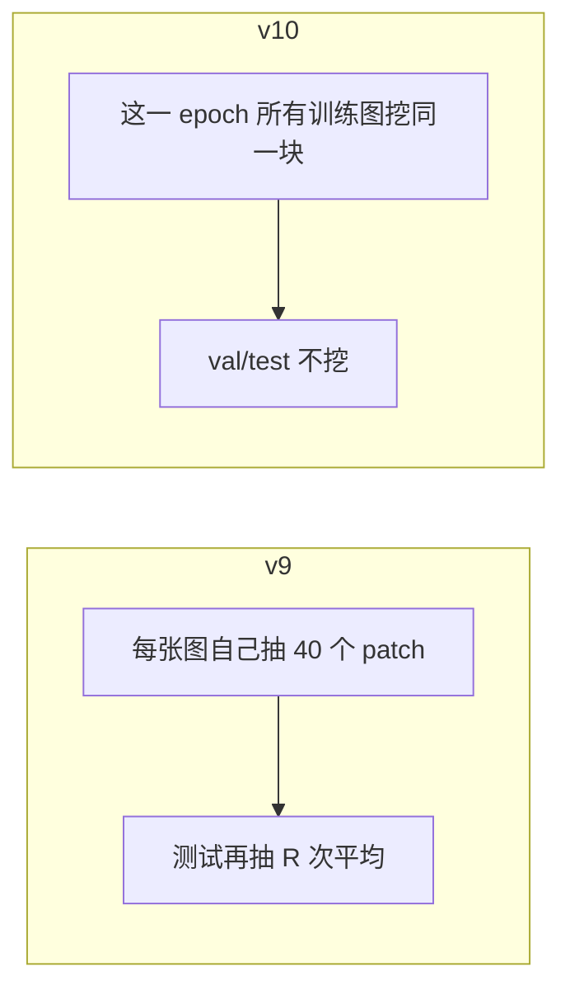

# MaSE-Net Lite **v10** — Shared-Fixed-Region Mask (SFRM)

老师草图「全体图像共用一块随机区域」的可跑版本。  
**v9** 是每张图独立随机 patch（RF bagging）；**v10** 是整批共用一个 \(S\times S\) 窗口。

| | **v9 RSB** | **v10 SFRM（本版）** |
|--|------------|----------------------|
| Mask | 每张图独立 random top-k | **所有训练图共用** 同一 \(S\times S\) 置零窗 |
| 何时 | 每个 forward | **每个 train epoch 换一次窗** |
| Val / test | 随机 mask / RSB 平均 | **不遮挡**（全图） |
| 配方 | Phase-1 微调 heads+`w` | **v4 frozen \(w=0.25\)**，默认关掉 selector |
| 已有结果 | 全量 RSB **86.28%**（learned 对照 88.96%） | 5% unmasked **85.09%** / +selector **85.71%**（5% v4 **85.87%**） |

**仍是单模型。** `--v10` = `--sfrm`。不要和 `--v9` 同时开。

### 架构差在哪



v9：空间 **bagging**（样本间 mask 不共享，测试要投票才算主数字）。  
v10：空间 **共享 Cutout**（样本间 mask 共享，主数字是未遮挡 test）。细节见 [V9_RUN.md](V9_RUN.md)、[ARCHITECTURE.md §10](ARCHITECTURE.md#10-later-recipes-v8--v9--v10)、图解 [SFRM_explained.html](SFRM_explained.html)。

**Repo:** https://github.com/una-sariel/deepyeast-mase

---

## 老师机器：git pull 后直接跑全量

```powershell
$REPO = "D:\UG Research\DeepYeast\Qiwu\deepyeast-mase-main_v12\deepyeast-mase"
$DATA = "D:\UG Research\DeepYeast\Qiwu\deepyeast-mase-main_v12\deepyeast_full"
cd $REPO
git pull
.venv\Scripts\activate
python -c "t=open('pytorch/train_mase_lite.py',encoding='utf-8').read(); print('v10 OK' if '--v10' in t else 'git pull again')"
```

Init（仓库自带，与 v4 全量相同）：

```powershell
dir artifacts\checkpoints_5pct\plcnn_triple\best.pt
```

### 一条命令（推荐）

```powershell
python pytorch\train_mase_lite.py `
  --data-dir $DATA `
  --v10 `
  --seed 42
```

进度条：**`MaSELiteV10`**。日志里有 `sfrm=(r,c,S)`。默认 checkpoint：`mase_lite_full_v10`。

`--v10` 会：frozen \(w=0.25\)、selector **bypass**、每 epoch 一块 \(S=24\) 训练遮挡、训完做 7 窗投票。epoch/patience 与 v4 相同（60 / 15）。GPU 上按 v4 全量估时。

叠上 learned selector（5% 上更好的那版）：

```powershell
python pytorch\train_mase_lite.py `
  --data-dir $DATA `
  --v10 --sfrm-keep-selector --sfrm-size 16 --sfrm-windows 0 `
  --seed 42 `
  --checkpoint-name mase_lite_full_v10_sel
```

### 可选：从已有 v4 / Phase-1 微调（更短）

```powershell
python pytorch\train_mase_lite.py `
  --data-dir $DATA `
  --v10 `
  --resume "$DATA\checkpoints\mase_lite_full_v4\best.pt" `
  --epochs 15 --patience 5 `
  --seed 42
```

没有 v4 就换 Phase-1：`$DATA\checkpoints\mase_lite_full_v6_phase1\best.pt`。

---

## 请发回

```text
1) <deepyeast_full>\checkpoints\mase_lite_full_v10\results.json
2) <deepyeast_full>\checkpoints\mase_lite_full_v10\sfrm_vote\summary.json
```

报两行：**未遮挡 test**（`results.json` → `test.accuracy`）和 **投票 test**（`sfrm_vote`）。主数字用未遮挡。对照：v4 全量 ≈89.58%，P2.5+TTA **89.82%**。

---

## Defaults

| Knob | Value |
|------|--------|
| Recipe | v4 fused-CE, frozen \(w=0.25\) |
| Selector | **bypass**（除非 `--sfrm-keep-selector`） |
| SFRM size | 24 |
| When | one window / train epoch, **all** train images |
| Val / test | no SFRM |
| Vote | 7 windows + full image（`--sfrm-windows 0` 可关） |
| Init | `artifacts/checkpoints_5pct/plcnn_triple`；bypass 时不加载 selector |
| Checkpoint | `mase_lite_full_v10` |

---

## 5% 已跑（本机 CPU, 2026-08-13）

JSON: `results/v10/5pct_results.json`, `results/v10/5pct_vote_summary.json`, `results/v10/5pct_sel_results.json`

| Metric | v10 bypass S=24 | v10+selector S=16 | 5% v4 |
|--------|-----------------|-------------------|-------|
| Best val | 83.22% @ ep49 | **83.68%** @ ep49 | 82.7% |
| Unmasked test | **85.09%** | **85.71%** | **85.87%** |
| 7-window vote test | 84.27% (−0.64pp) | skipped | — |
| Val mask | 1.000 (bypass) | 0.625 (top-k) | learned top-k |
| Weights | frozen 0.25×4 | frozen 0.25×4 | frozen 0.25×4 |
| Elapsed | 257.8 min CPU | 264.9 min CPU | — |

对照 v9 全量（不是 5%，不可直接比）：RSB **86.28%** / learned **88.96%** / random **84.87%**（`results/v9/`）。

**Readout:** 5% 上 v10 没超过 v4（最好 −0.16pp）。投票掉点。全量当方法故事跑即可，不要预期一定涨点。
