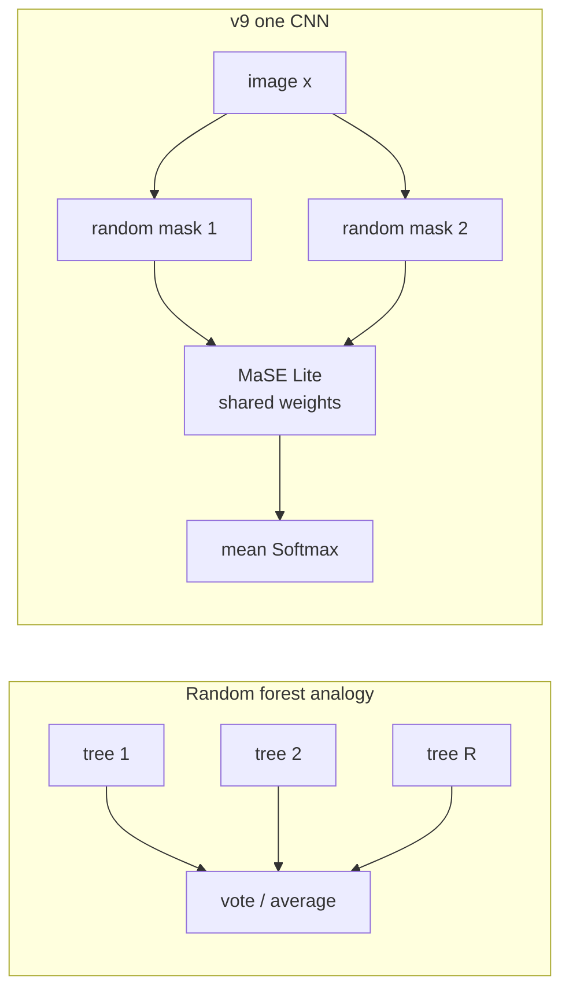

# MaSE-Net Lite **v9** — Random Spatial Bagging (RSB)

Runnable version of the professor’s “random mask + forest” sketch. **Still one model** (not sklearn RF, not multi-seed).

| | Sketch (weak) | **v9 (this recipe)** |
|--|---------------|----------------------|
| Mask | **one** random region shared by **all** images | **per-image** random top-k patches |
| Role | Cutout-style occlusion | RF **feature bagging** (spatial) |
| Test | single occluded view | average Softmax over **R** random views (**RSB**) |
| Train | — | fine-tune heads + `w` from Phase-1; selector/branches frozen |

Primary comparison: **learned** MaSE mask on the **same** weights. Shared-region sketch is **[v10 SFRM](V10_RUN.md)** (full v9 vs v10 table at the end of that file).

**Repo:** https://github.com/una-sariel/deepyeast-mase

---

## Files to send back

```text
1) <deepyeast_full>\checkpoints\mase_lite_full_v9\results.json
2) <deepyeast_full>\checkpoints\mase_lite_full_v9\rsb_eval\summary.json
```

In `rsb_eval/summary.json` look for `splits.test`:

- `rsb.accuracy` ← **primary v9 number** (R-mask average)
- `random_single.accuracy` ← single random mask
- `learned_single.accuracy` ← same weights + learned selector (reference)

---

## Paths

```powershell
$REPO = "D:\UG Research\DeepYeast\Qiwu\deepyeast-mase-main_v12\deepyeast-mase"
$DATA = "D:\UG Research\DeepYeast\Qiwu\deepyeast-mase-main_v12\deepyeast_full"
cd $REPO
git pull
.venv\Scripts\activate
python -c "t=open('pytorch/train_mase_lite.py',encoding='utf-8').read(); print('v9 OK' if '--v9' in t else 'git pull again')"
```

Need Phase-1 weights:

```powershell
dir "$DATA\checkpoints\mase_lite_full_v6_phase1\best.pt"
```

No Phase-1? Pass an existing strong checkpoint:

```powershell
--resume "$DATA\checkpoints\mase_lite_full_v4\best.pt"
```

---

## Train v9 (~15–45 min on GPU)

```powershell
python pytorch\train_mase_lite.py `
  --data-dir $DATA `
  --v9 `
  --seed 42
```

Progress bar: **`MaSELiteV9`**

`--v9` auto-runs RSB eval (`--with-rsb`, default `R=16`). Do **not** combine with `--v10` / `--sfrm`.

### Defaults

| Knob | Value |
|------|-------|
| Resume | Phase-1 `best.pt` |
| Trainable | 4 heads + `ensemble_logits` |
| Frozen | selector + PLCNN branches |
| `mask_mode` | **random** (per-image top-k) |
| `top_k_patches` | 40 / 64 |
| `rsb_samples` | **16** |
| `min_ensemble_weight` | 0.15 |
| `ensemble_entropy_weight` | 0.02 |
| epochs / patience | 15 / 5 |

### Optional knobs

```powershell
python pytorch\train_mase_lite.py --data-dir $DATA --v9 --rsb-samples 32 --seed 42
```

---

## Eval only (no retrain)

```powershell
python pytorch\eval_mase_rsb.py `
  --data-dir $DATA `
  --checkpoint "$DATA\checkpoints\mase_lite_full_v9\best.pt" `
  --rsb-samples 16 `
  --split both `
  --out-dir "$DATA\checkpoints\mase_lite_full_v9\rsb_eval"
```

---

## Success criteria

| Metric | Target |
|--------|--------|
| `rsb_eval` test `rsb.accuracy` | report vs Phase-1 (~0.8895) and Phase2.5+TTA (**0.8982**) |
| `weight_health.ok` | true |
| vs `learned_single` | if RSB ≪ learned → random bagging is weaker than selector |

Report **train test** (random-mask forward) and **RSB test** as separate rows.

---

## What “RSB” means (English)

**RSB** = **R**andom **S**patial **B**agging. Project nickname, not a paper title. The sketch had Random Forest + random masks. We do **not** train sklearn trees on pixels, and we do **not** train many CNNs. One `best.pt`.

Random forests drop correlated error by giving each tree a **random feature subset**, then **voting**. v9 copies that bias onto MaSE’s **64** patches: each image keeps a random **40 / 64** (`mask_mode=random`). At test, draw **R** independent masks and **average Softmax**.

### Why rewrite the sketch this way

| Sketch element | Do not implement literally | Runnable v9 |
|----------------|----------------------------|-------------|
| Random Forest | sklearn RF on pixels, coupled to CNN backprop | random **spatial** feature subset (patches) |
| Many trees → many Ŷ → bagging | train M full CNNs (expensive, breaks “one model”) | **one** CNN + **R** random views, mean Softmax |
| One region for **all** images | that is **[v10](V10_RUN.md)**, not v9 | v9 masks are **per-image**, not shared |

**Role:** method / ablation vs the **learned selector**. Not a promise to hit 90%.

### Before v9 (learned MaSE / v4)

- The selector **learns** which patches matter; the mask is **input-dependent**.
- Test uses that learned mask (or later flip/rot TTA), not a random view.

### After v9 (RSB)

- Every forward draws a **new per-image** random top-k mask (no shared region across the train set).
- Primary test number is the **R-view Softmax average**, not a single random hole.

| Random forest | v9 |
|---------------|-----|
| One tree | One random top-k patch mask on the **same** CNN |
| Feature bagging | Random 40/64 patches **per image** |
| Bootstrap row | Same image; only the mask changes |
| Forest vote | Mean Softmax over **R=16** masks |
| Many `.pkl` files | **One** checkpoint (selector + branches frozen; heads + `w` trained) |



**Train:** resume Phase-1 → freeze selector + branches → train heads + `ensemble_logits`. Every forward: independent random 40/64 patches on **that** image.

**Test (primary):** `eval_mase_rsb.py` averages R Softmax vectors. Also log `random_single` and `learned_single` (selector on, same weights).

Trainer `test.accuracy` in `results.json` is a **single** random-mask forward (last epoch). That is **not** the RSB number. Always prefer `rsb_eval`.

### vs learned selector / Flip-TTA / true bagging

| Mechanism | Who decides what to drop | Per-image? | Stage |
|-----------|--------------------------|------------|-------|
| MaSE learned selector | network scores 64 patches, top-k | yes | train + test (differentiable) |
| **v9 RSB** | uniform random 40/64 patches | yes, independent | every forward; test averages R views |
| v10 SFRM | one shared \(S\times S\) pixel hole | **no** (shared on train) | train only; val/test unmasked |
| Flip / rot90 TTA | geometry | after transform | test only |

True bagging would be **M weight files**. v9 keeps **one** file and bags **views**. That matches the “one model” constraint.

### Protocol notes

- Patch grid is **8×8 = 64** on a \(64\times64\) image (same as MaSE). Random top-k is over **patches**, not a pixel rectangle.
- Val during training also uses random masks, so val is **not** comparable to Phase-1 learned-mask val. The Phase-1 val gate (0.8875) was not beaten; that is expected.
- `learned_single` turns the **frozen** selector back on at eval. It is the fair “same weights, MaSE mask” reference.

### FAQ

**Is this a Random Forest?** Spiritually (random subspace + vote), not literally. Write it that way in a paper; do not claim sklearn RF.

**Why average R views at test?** That **is** the forest-vote analogue. A single random mask is just noisy Cutout.

**Does this block the cell every time?** Each image / forward draws a new subset. Over R=16 views the dropped patches vary. It is not one fixed hole.

**Relation to 90%?** Parallel ablation. Accuracy mainline is still strong frozen ckpt (v4) → light FT → flip_rot TTA. Do not promote v9 over Phase-1 / v4 / P2.5+TTA.

**Not v9:** one shared \(S\times S\) hole for the whole train set — **[v10 SFRM](V10_RUN.md)**. On v10, train occludes; **val/test are unmasked**. Those two lines are train vs test, not a contradiction.

### One-line takeaway

> **RSB = random per-image patch bagging + Softmax vote on one CNN, not a sklearn forest and not a shared hole on all images.**

---

## 「RSB」是什么（中文说明）

**RSB** = **R**andom **S**patial **B**agging（随机空间袋装）。项目里的叫法，不是论文正式方法名。草图里有 Random Forest + 随机遮盖。我们**不**在像素上训 sklearn 树，也**不**训多份 CNN。一份 `best.pt`。

随机森林靠「每棵树看不同特征子集」再投票来降相关误差。v9 把这件事搬到 MaSE 的 **64 个 patch**：每张图随机留 **40 / 64**（`mask_mode=random`）。测试再抽 **R** 次 mask，对 Softmax **平均**。

### 为什么要这样改写草图

| 草图元素 | 不宜直接做的 | 可跑的 v9 |
|----------|--------------|-----------|
| Random Forest | 像素上端到端训 sklearn RF，并和 CNN 反传耦合 | 用随机 **空间** 特征子集（patch） |
| 多棵树 → 多个 Ŷ → Bagging | 训 M 份大 CNN（贵，且与「单模型」冲突） | **一份** CNN + **R** 个随机视野，Softmax 平均 |
| 全体图同一区域 | 那是 **[v10](V10_RUN.md)**，不是 v9 | v9 的 mask **按图独立**，不共享 |

**定位：** 方法/消融，对照 **可学习 selector**。不保证单独冲到 90%。

### v9 之前（learned MaSE / v4）

- Selector **学**哪些 patch 重要；mask **随图变化**。
- 测试用学到的 mask（或后来的 flip/rot TTA），不是随机视野。

### v9（RSB）

- 每次 forward 给**这一张图**抽新的随机 top-k mask（训练集不共享同一块区域）。
- 主测试数字是 **R 次 Softmax 平均**，不是单次随机挖洞。

| 随机森林 | v9 |
|----------|-----|
| 一棵树 | 同网络上的一次随机 top-k patch 视野 |
| 特征 bagging | **每张图**独立随机 40/64 patch |
| Bootstrap 样本 | 还是这张图，只换 mask |
| 森林投票 | **R=16** 次 Softmax 平均 |
| 很多 `.pkl` | **一份**权重（冻 selector/分支，训 heads+`w`） |

**训练：** Phase-1 → 冻 selector + 分支 → 训 heads + `ensemble_logits`。每次 forward：这张图自己的随机 40/64 patch。

**测试（主数字）：** `eval_mase_rsb.py` 对 R 个 Softmax 平均。另外记录 `random_single` 和 `learned_single`（同一权重把 selector 打开）。

`results.json` 里的 trainer `test.accuracy` 是**单次**随机 mask 前向（最后一轮），**不是** RSB 数字。对外请用 `rsb_eval`。

### 和 learned selector / Flip-TTA / 真袋装的差别

| 机制 | 谁决定丢掉什么 | 随图变化？ | 阶段 |
|------|----------------|------------|------|
| MaSE learned selector | 网络给 64 patch 打分，top-k | 是 | 训练+测试（可微） |
| **v9 RSB** | 均匀随机 40/64 patch | 是，彼此独立 | 每个 forward；测试平均 R 次 |
| v10 SFRM | 一块共享的 \(S\times S\) 像素洞 | **否**（训练共享） | 仅训练；val/test 不遮 |
| Flip / rot90 TTA | 几何变换 | 变换后 | 仅测试 |

真 Bagging 是 **M 份权重**。v9 只有 **一份**，袋装的是 **视野**。符合「单模型」。

### 协议细节

- 图 \(64\times64\)，patch **8×8 → 64 格**（和 MaSE 一样）。随机 top-k 是 **patch**，不是像素矩形。
- 训练时 val 也用随机 mask，所以 val **不能**和 Phase-1 的 learned-mask val 直接比。没超过 Phase-1 val 门槛（0.8875）是预期内的。
- `learned_single` 在 eval 时把**冻结的** selector 打开，作为「同一权重、MaSE mask」对照。

### 常见疑问

**这还算 Random Forest 吗？** 精神上是（随机子空间 + 投票），字面上不是。论文/汇报里写清楚，避免被当成 sklearn RF。

**测试为什么要平均 R 次？** 这就是「森林投票」的类比。单次随机 mask 只是带噪声的 Cutout。

**会不会总挡住细胞？** 每张图 / 每次 forward 换子集。R=16 次丢掉的 patch 会变，不是固定一块洞。

**和冲 90% 什么关系？** 并行消融。精度主线仍是强 frozen ckpt（v4）→ 轻量微调 → flip_rot TTA。不要把 v9 抬到 Phase-1 / v4 / P2.5+TTA 上面。

**不是 v9：** 全体训练图共用一块 \(S\times S\) 洞 —— **[v10 SFRM](V10_RUN.md)**。v10 **训练**挖洞，**val/test 全图不遮**。这两句分别说训练和测试，不冲突。

### 一句话

> **RSB = 一份 CNN 上的「每张图随机 patch 袋装 + Softmax 投票」，不是 sklearn 森林，也不是全体图共用一块洞。**

---

## Full-data result (English; seed=42, professor run, `deepyeast-mase-main_v12`)

Sources: [`results/v9/results.json`](results/v9/results.json), [`results/v9/rsb_summary.json`](results/v9/rsb_summary.json). Workspace copies: `docs/mase_results/v9/`.

Resume Phase-1. Trainable: heads + `w`. `mask_mode=random`. `weight_health.ok` (`w≈[0.208, 0.221, 0.241, 0.330]`).

No epoch beat the Phase-1 val gate (0.8875); random-mask val peaked **85.08%** @ ep4 (`best_epoch=0` / `best_val=-1` in trainer JSON is the unused learned-mask gate). Trainer test is the last-epoch **single** random-mask forward.

| Split | Random single | **RSB R=16** | Learned selector (same ckpt) | n |
|-------|---------------|--------------|------------------------------|---|
| Val (`rsb_eval`) | 83.52% | **85.36%** | 88.78% | 12500 |
| **Test (`rsb_eval`)** | 84.50% | **86.28%** | **88.96%** | 12500 |
| Test (trainer `results.json`) | 84.87% | — | — | 12500 |

| Compare | Acc | vs v9 RSB test |
|---------|-----|----------------|
| Phase 1 | 88.95% | −2.67pp |
| v4 train | ≈89.58% | −3.30pp |
| Phase 2.5 / v7 + TTA | **89.82%** | −3.54pp |
| learned_single (this ckpt) | 88.96% | −2.68pp |

**Readout:** RSB **hurts** vs the learned selector on the same weights. Method story, not the 90% path. Do not promote v9 over Phase-1 / v4 / P2.5+TTA.

---

## 全量结果（中文；seed=42，老师机器，`deepyeast-mase-main_v12`）

来源：[`results/v9/results.json`](results/v9/results.json)，[`results/v9/rsb_summary.json`](results/v9/rsb_summary.json)。

从 Phase-1 接着训。可训：heads + `w`。`mask_mode=random`。`weight_health.ok`（`w≈[0.208, 0.221, 0.241, 0.330]`）。

没有任何 epoch 超过 Phase-1 的 val 门槛（0.8875）；随机 mask 的 val 最高 **85.08%**（ep4）。trainer 的 test 是最后一轮**单次**随机 mask。

| 划分 | Random 单次 | **RSB R=16** | 同权重 learned selector | n |
|------|-------------|--------------|-------------------------|---|
| Val | 83.52% | **85.36%** | 88.78% | 12500 |
| **Test** | 84.50% | **86.28%** | **88.96%** | 12500 |
| Test（trainer） | 84.87% | — | — | 12500 |

| 对照 | Acc | 相对 v9 RSB test |
|------|-----|------------------|
| Phase 1 | 88.95% | −2.67pp |
| v4 train | ≈89.58% | −3.30pp |
| Phase 2.5 / v7 + TTA | **89.82%** | −3.54pp |
| learned_single（本 ckpt） | 88.96% | −2.68pp |

**读数：** 同一权重上，RSB **低于** learned selector。方法故事，不是 90% 主线。不要把 v9 排到 Phase-1 / v4 / P2.5+TTA 前面。
